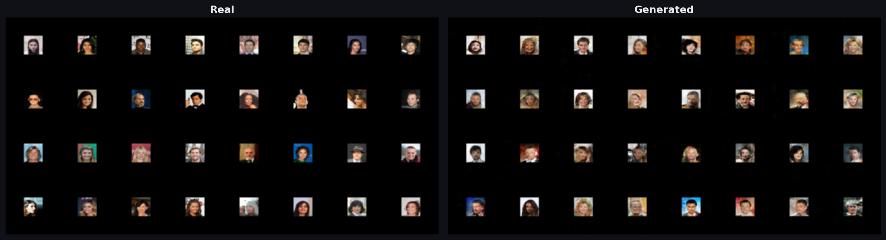
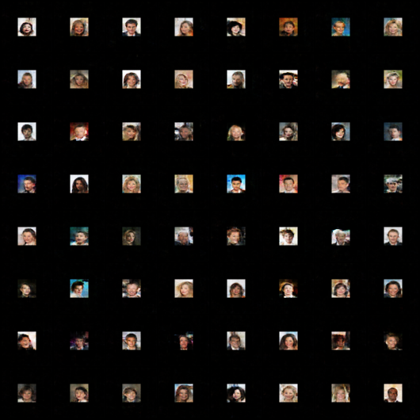
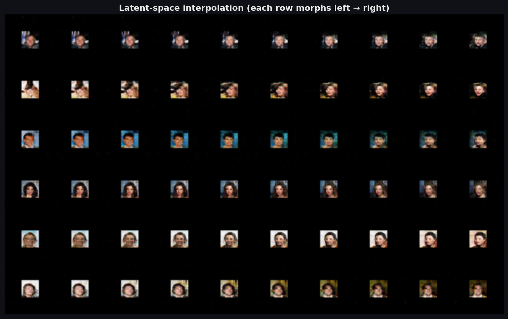
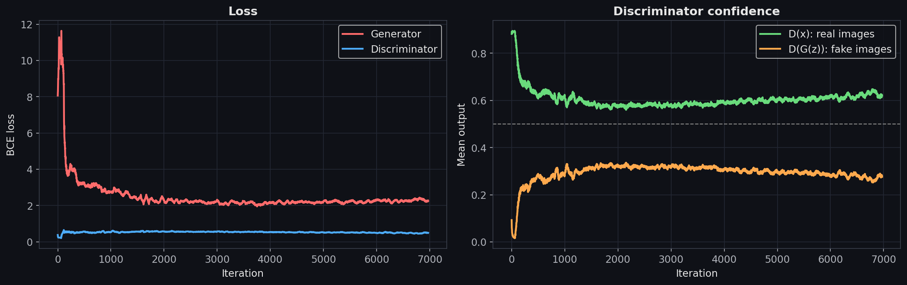

<h1 align="center">🎭 DCGAN Face Generator</h1>

<p align="center">
  Generating realistic 64×64 faces from pure noise with a Deep Convolutional GAN, built from scratch in PyTorch and trained on CelebA.
</p>

<p align="center">
  <a href="https://colab.research.google.com/github/YOUR_USERNAME/gan-celeba/blob/main/gan_pipeline.ipynb">
    
  </a>
  
  
</p>

<p align="center">
  
</p>
<p align="center"><i>The same 64 noise vectors rendered after every epoch: static becomes faces.</i></p>

---

## ✨ Highlights

- **DCGAN architecture**: transposed-conv generator + strided-conv discriminator (Radford et al., 2015)
- **Watchable training**: fixed noise vectors, per-epoch sample grids and an auto-generated GIF
- **Stability tricks**: DCGAN weight init, BatchNorm, LeakyReLU, one-sided label smoothing
- **Rich diagnostics**: loss curves plus `D(x)` / `D(G(z))` confidence tracking
- **Latent-space morphing** using spherical interpolation (slerp)
- **Reproducible**: seeded, single `CONFIG` dictionary, checkpoints saved

## 🖼️ Results

| Real faces | Generated faces |
|:---:|:---:|
|  |  |

**Latent-space interpolation**: each row smoothly morphs one generated face into another.

<p align="center"></p>

**Training curves**

<p align="center"></p>

## 🧠 How it works

| | Generator | Discriminator |
|---|---|---|
| **Input** | Noise vector `z ∈ ℝ¹⁰⁰` | 3×64×64 image |
| **Layers** | 5 × ConvTranspose2d (BatchNorm + ReLU) | 5 × Conv2d (BatchNorm + LeakyReLU 0.2) |
| **Shape flow** | 100 → 512×4×4 → 256×8×8 → 128×16×16 → 64×32×32 → 3×64×64 | 3×64×64 → 64×32×32 → 128×16×16 → 256×8×8 → 512×4×4 → 1 |
| **Output** | Tanh, pixels in [-1, 1] | Sigmoid, P(real) |

**Training loop** (per batch)
1. Update **D** on real faces (target 0.9, smoothed) and detached fakes (target 0).
2. Update **G** so that D classifies its fakes as real (target 1).

**Hyper-parameters**

| Setting | Value |
|---|---|
| Image size | 64×64 |
| Batch size | 128 |
| Optimizer | Adam, lr = 2e-4, β₁ = 0.5 |
| Latent dim | 100 |
| Epochs | 30 |
| Loss | Binary cross-entropy |

## 🚀 Quick start

### Option 1: Google Colab (easiest)
Click the **Open in Colab** badge, set `Runtime → Change runtime type → T4 GPU`, then `Runtime → Run all`.

### Option 2: Run locally
```bash
git clone https://github.com/YOUR_USERNAME/gan-celeba.git
cd gan-celeba
python -m venv .venv && source .venv/bin/activate   # Windows: .venv\Scripts\activate
pip install -r requirements.txt
jupyter notebook gan_pipeline.ipynb
```

The dataset downloads automatically through [`kagglehub`](https://github.com/Kaggle/kagglehub).
If you already have the images, set `CONFIG["data_dir"]` to their folder.

## 📁 Repository structure

```
gan-celeba/
├── gan_pipeline.ipynb     # full pipeline: data → model → training → results
├── requirements.txt
├── assets/                # figures used in this README
│   ├── training_progress.gif
│   ├── final_samples.png
│   ├── real_vs_fake.png
│   ├── latent_interpolation.png
│   └── loss_curve.png
├── LICENSE
└── README.md
```

## 🔭 Next steps

- [ ] Train on the full 200k CelebA images
- [ ] WGAN-GP / spectral normalisation for more stable training
- [ ] FID score for quantitative evaluation
- [ ] Conditional generation (smiling, glasses, hair colour)
- [ ] Higher resolution (128×128)

## 📚 References

- Goodfellow et al., [*Generative Adversarial Networks*](https://arxiv.org/abs/1406.2661), 2014
- Radford, Metz & Chintala, [*Unsupervised Representation Learning with Deep Convolutional GANs*](https://arxiv.org/abs/1511.06434), 2015
- Liu et al., [*Deep Learning Face Attributes in the Wild*](https://mmlab.ie.cuhk.edu.hk/projects/CelebA.html) (CelebA), ICCV 2015

## 📄 License

MIT: see [LICENSE](LICENSE).
