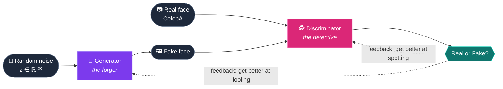

<!-- ═══════════════════════════ HEADER ═══════════════════════════ -->
<div align="center">


<a href="https://git.io/typing-svg">
  
</a>

<br/><br/>

<a href="https://colab.research.google.com/github/sumitjhadev/Generative-Adversarial-Network-GAN/blob/main/gan_pipeline.ipynb">
  
</a>


<br/><br/>


<sub><i>The same 64 noise vectors, rendered after every epoch. Watch static turn into faces.</i></sub>

</div>

<br/>

---

## 📖 &nbsp;What is this?

A **Generative Adversarial Network (GAN)** is two neural networks locked in a game. One forges, the other investigates, and both get better by trying to beat each other.

This project builds a **DCGAN** (Deep Convolutional GAN) from scratch in PyTorch. It starts from nothing but random numbers and learns to paint realistic **64×64 human faces**.

<div align="center">



</div>

---

## ✨ &nbsp;Highlights

<table>
<tr>
<td width="50%" valign="top">

### 🧠 Architecture
Transposed-conv **generator** and strided-conv **discriminator**, following Radford et al. (2015), with DCGAN weight init and BatchNorm.

</td>
<td width="50%" valign="top">

### 🎞️ Watchable training
A **fixed noise** batch is rendered every epoch, and the notebook auto-builds a **GIF** of the generator improving.

</td>
</tr>
<tr>
<td width="50%" valign="top">

### 🛡️ Stable training
**One-sided label smoothing**, LeakyReLU and Adam (β₁ = 0.5) keep the two networks in balance.

</td>
<td width="50%" valign="top">

### 📊 Real diagnostics
Loss curves plus **D(x)** and **D(G(z))** tracking, so you can see who is winning the game.

</td>
</tr>
<tr>
<td width="50%" valign="top">

### 🌀 Latent-space morphing
**Spherical interpolation (slerp)** smoothly morphs one generated face into another.

</td>
<td width="50%" valign="top">

### ♻️ Reproducible
Seeded runs, one `CONFIG` dictionary and saved checkpoints. Reload the generator and sample new faces any time.

</td>
</tr>
</table>

---

## 🖼️ &nbsp;Results

<div align="center">

### Real vs. Generated


<br/><br/>

### Final samples


<br/><br/>

### Latent-space interpolation
<sub>Each row morphs one generated face into another, left to right.</sub>


<br/><br/>

### Training curves


</div>

---

## 🏗️ &nbsp;Architecture

<table>
<tr>
<th width="50%" align="center">🎨 Generator</th>
<th width="50%" align="center">🕵️ Discriminator</th>
</tr>
<tr>
<td>

```
z  (100)
 ↓  ConvT + BN + ReLU
512 × 4 × 4
 ↓  ConvT + BN + ReLU
256 × 8 × 8
 ↓  ConvT + BN + ReLU
128 × 16 × 16
 ↓  ConvT + BN + ReLU
 64 × 32 × 32
 ↓  ConvT + Tanh
  3 × 64 × 64
```

</td>
<td>

```
  3 × 64 × 64
 ↓  Conv + LeakyReLU
 64 × 32 × 32
 ↓  Conv + BN + LeakyReLU
128 × 16 × 16
 ↓  Conv + BN + LeakyReLU
256 × 8 × 8
 ↓  Conv + BN + LeakyReLU
512 × 4 × 4
 ↓  Conv + Sigmoid
  P(real)
```

</td>
</tr>
</table>

### ⚙️ Training setup

| Setting | Value |
|:--|:--|
| 🖼️ Image size | 64 × 64 RGB, normalised to [-1, 1] |
| 🎲 Latent dimension | 100 |
| 📦 Batch size | 128 |
| 🔁 Epochs | 30 |
| 🧮 Optimizer | Adam, lr = 2e-4, β₁ = 0.5 |
| 📉 Loss | Binary cross-entropy |
| 🎯 Label smoothing | Real target = 0.9 (discriminator only) |

<details>
<summary><b>🔍 &nbsp;Why DCGAN and not a simple fully-connected GAN?</b></summary>

<br/>

A plain MLP GAN flattens the image into one long vector and loses all 2-D structure, so it tends to produce blurry, noisy blobs. **Convolutions** share weights across the image and learn local patterns (edges, then eyes and noses, then whole faces), which is why DCGAN became the standard baseline for image generation.

</details>

<details>
<summary><b>🔁 &nbsp;What happens in one training step?</b></summary>

<br/>

1. **Train the Discriminator.** Show it a batch of real faces (target 0.9) and a batch of fakes (target 0). Fakes go through `.detach()` so this step doesn't update the generator.
2. **Train the Generator.** Pass fresh fakes through the updated discriminator and reward the generator when it says "real" (target 1).
3. **Log** the losses, `D(x)` and `D(G(z))`.

In a healthy run, `D(x)` sits a little above 0.5, `D(G(z))` a little below, and neither network runs away with the game.

</details>

---

## 🚀 &nbsp;Quick start

### ☁️ Option 1: Google Colab (easiest)

1. Click the **Open in Colab** badge at the top
2. `Runtime → Change runtime type → T4 GPU`
3. `Runtime → Run all`

### 💻 Option 2: Run locally

```bash
git clone https://github.com/sumitjhadev/Generative-Adversarial-Network-GAN.git
cd Generative-Adversarial-Network-GAN

python -m venv .venv
source .venv/bin/activate        # Windows: .venv\Scripts\activate
pip install -r requirements.txt

jupyter notebook gan_pipeline.ipynb
```

> 💡 The dataset downloads automatically via [`kagglehub`](https://github.com/Kaggle/kagglehub). Already have the images? Set `CONFIG["data_dir"]` to their folder.

### 🎲 Generate new faces from the saved model

```python
g = Generator(100).to(device)
g.load_state_dict(torch.load("checkpoints/generator_latest.pt", map_location=device))
g.eval()

with torch.no_grad():
    faces = g(torch.randn(32, 100, device=device)).cpu()
```

---

## 📁 &nbsp;Project structure

```
📦 Generative-Adversarial-Network-GAN
 ┣ 📓 gan_pipeline.ipynb        ← data → model → training → results
 ┣ 📂 assets                    ← figures shown in this README
 ┃ ┣ 🎞️ training_progress.gif
 ┃ ┣ 🖼️ final_samples.png
 ┃ ┣ 🖼️ real_vs_fake.png
 ┃ ┣ 🖼️ latent_interpolation.png
 ┃ ┗ 📈 loss_curve.png
 ┣ 📄 requirements.txt
 ┣ 📄 LICENSE
 ┗ 📄 README.md
```

---

## 🔭 &nbsp;Roadmap

- [x] DCGAN generator and discriminator
- [x] Fixed-noise progress tracking and training GIF
- [x] Latent-space interpolation
- [ ] Train on the full 200k-image CelebA
- [ ] WGAN-GP / spectral normalisation for more stable training
- [ ] FID score for quantitative evaluation
- [ ] Conditional generation (smiling, glasses, hair colour)
- [ ] Higher resolution (128 × 128)

---

## 📚 &nbsp;References

| | |
|:--|:--|
| 📄 | Goodfellow et al., [*Generative Adversarial Networks*](https://arxiv.org/abs/1406.2661), 2014 |
| 📄 | Radford, Metz & Chintala, [*Unsupervised Representation Learning with Deep Convolutional GANs*](https://arxiv.org/abs/1511.06434), 2015 |
| 🗂️ | Liu et al., [*Deep Learning Face Attributes in the Wild* (CelebA)](https://mmlab.ie.cuhk.edu.hk/projects/CelebA.html), ICCV 2015 |

---

<div align="center">

### ⭐ If you found this useful, consider giving it a star!

<sub>Released under the <a href="LICENSE">MIT License</a></sub>


</div>
